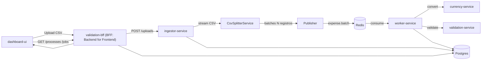

# Validation Platform

Desarrollador: Mauricio Vergara | mvergaracid.cl

Plataforma de ingesta y validación de gastos a partir de archivos CSV. El objetivo es:

- Ingerir archivos CSV (potencialmente grandes) sin cargarlos completamente en memoria.
- Partir el CSV en batches para procesarlo en paralelo/por bloques.
- Normalizar y enriquecer cada gasto (deduplicación, conversión de moneda, normalización de montos).
- Evaluar reglas de validación configurables vía **policies**.
- Persistir los resultados y exponerlos en un dashboard.

## Flujo (alto nivel)



## Nota sobre alcance (prueba técnica)

Este proyecto está desarrollado como una **prueba técnica** orientada a demostrar arquitectura, flujo de procesamiento y capacidad de extensión.

Para simplificar, el **modelo de datos de gastos** se basó en el **CSV histórico proporcionado**. Ese CSV **no representa un estándar productivo** (por ejemplo, el uso de *slugs* de texto para identificar clientes, categorías o conceptos). En un sistema productivo esto debiese evolucionar a:

- Identificadores enteros o preferentemente **UUID** para entidades (cliente, usuario, centro de costo, categoría, etc.).
- Validación de integridad referencial (FK) y catálogos maestros.
- Contratos de entrada versionados (schema) para evitar ambigüedades.

## Piezas principales (responsabilidad)

- **dashboard-ui (Angular)**
  - Interfaz para:
    - Subir CSV.
    - Ver `FileProcess` (proceso del archivo), batches publicados, jobs y detalle por job.
    - Editar la policy actual (`/settings/policies`).
  - Se mantiene intencionalmente “tonta”: valida que el texto sea JSON parseable para poder enviarlo y muestra feedback con toast.

- **validation-bff (NestJS)**
  - API para el dashboard.
  - Orquesta llamadas al ingestor y consultas a DB.
  - Expone:
    - `GET/PUT /policies/current` para administrar policies.
    - Endpoints de procesos/jobs/batches/uploads.
  - Persiste la policy en `validation_policies (name='current')`.
  - Fallback: si no existe registro en DB, usa `DEFAULT_POLICIES` (env).

- **ingestor-service (NestJS)**
  - Recibe un CSV (upload o referencia a storage local), lo lee por streaming y lo parte en batches.
  - Persiste:
    - `file_processes` (estado del proceso de ingesta/publicación)
    - `file_process_batches` (metadatos por batch: batch_index, record_count, expense_ids)
  - Publica batches al worker (topic `expense.batch`).

- **worker-service (NestJS microservice)**
  - Consume eventos (`expense.batch`), procesa cada row como un job:
    - `dedup` (deduplicación): evita reprocesar por fingerprint (SHA-256) calculado sobre `monto_original`, `moneda_original` y `fecha` (Redis TTL, *time-to-live* + fallback a DB).
    - `normalize`: normaliza montos, detecta condiciones para omitir el registro.
    - `currency`: conversión a moneda base.
    - `validation`: evaluación de reglas.
    - `persist`: upsert de gasto con resultado.
  - Importante: si `monto_original` es negativo el registro **se omite** (no convierte/valida/persiste) y se registra el motivo.

- **validation-service (NestJS)**
  - Servicio de reglas:
    - antigüedad (`limite_antiguedad`)
    - límites por categoría (`limites_por_categoria`)
    - reglas por centro de costo (`reglas_centro_costo`)
  - Consume policies desde el request (`politicas`) o desde `DEFAULT_POLICIES` como fallback.

- **currency-service (NestJS)**
  - Conversión de moneda y cálculo de `monto_base`.
  - Usa Redis como cache de tipo de cambio (FX, *foreign exchange*).
  - Cuando se usa **OpenExchangeRates** (`OPENEXCHANGERATES_APP_ID`), se cachea además una **tabla completa de rates por fecha** (`fx_table:<YYYY-MM-DD|latest>`) en Redis. Esto permite resolver múltiples conversiones del mismo día con **1 llamada externa por fecha** (por TTL).

- **db-migrations**
  - Ejecuta migraciones para crear/actualizar esquemas.

- **Postgres / Redis**
  - Postgres: persistencia principal.
  - Redis: transporte de eventos (cuando se usa `WORKER_TRANSPORT=redis`), deduplicación y cache de FX (*foreign exchange*, tipo de cambio).

## FX (currency-service): cache por fecha (1 llamada externa por fecha)

Si `currency-service` está configurado con `OPENEXCHANGERATES_APP_ID`, la integración con OpenExchangeRates permite obtener en una sola llamada (por fecha) una tabla `rates` (tasas contra una moneda base, típicamente USD). La plataforma aprovecha esto con un cache adicional:

- `fx_table:<YYYY-MM-DD|latest>`: tabla completa de rates del proveedor para esa fecha.
- `fx:<FROM>:<TO>:<YYYY-MM-DD|latest>`: tasa por par específico (derivable desde la tabla).

Con esto:

- La **primera conversión** para una fecha (y dentro del TTL) hace **1 llamada externa** y guarda `fx_table:*`.
- Las conversiones siguientes de esa misma fecha calculan `FROM->TO` desde la tabla cacheada, evitando llamadas repetidas al proveedor externo.

Variables relevantes:

- `FX_CACHE_TTL_SECONDS`: TTL para rates cacheados (default 24h).
- `FX_TABLE_TTL_SECONDS`: TTL para la tabla por fecha (si no se define, usa `FX_CACHE_TTL_SECONDS`).

## CSV: streaming + batching (archivos grandes)

La ingesta del CSV está diseñada para evitar cargar el archivo completo en memoria.

- **Lectura por streaming**: `CsvSplitterService` usa `createReadStream()` + `csv-parse` y consume el stream con `for await ... of`.
- **Batching configurable**: el tamaño del batch está controlado por `BATCH_SIZE`.
  - En entornos reales típicamente se usan batches de **500** o **1000** filas (dependiendo del costo de validación y el throughput deseado).
  - En `docker-compose.yaml` el valor actual puede ser menor para facilitar pruebas.

Pseudoflujo:

1. Se lee una fila
2. Se acumula en `batch[]`
3. Si `batch.length == BATCH_SIZE`:
   - se persiste el batch (`file_process_batches`)
   - se publica el batch al worker
   - se reinicia el arreglo
4. Al terminar el stream, si queda batch parcial, se publica igualmente.

### Nota sobre el estado “COMPLETADO”

Actualmente `file_processes.status=COMPLETADO` se setea cuando el ingestor termina de **publicar** batches, no cuando el worker termina de **procesar** todas las filas. Esto está identificado como mejora pendiente.

## Trazabilidad y auditoría

El flujo fue pensado para poder **trazarse end-to-end**:

- El ingestor genera un **hash/identificador** del proceso del archivo (`FileProcess`).
- Ese identificador permite:
  - ubicar el proceso completo desde el dashboard/API,
  - ver los `FileProcessBatch` asociados,
  - y auditar los `JobRun` generados por el worker para cada registro.

En la práctica, cada batch (y los jobs derivados) quedan vinculados al proceso, lo que permite seguimiento y análisis de errores por archivo/batch/job.

## Policies (configuración de reglas)

### Forma del JSON
Las policies son un **objeto JSON plano**, con campos en la raíz (no van envueltas en `{ policies: ... }`). Ejemplo (similar a `DEFAULT_POLICIES`):

```json
{
  "moneda_base": "CLP",
  "limite_antiguedad": { "pendiente_dias": 30, "rechazado_dias": 90 },
  "limites_por_categoria": {
    "food": { "aprobado_hasta": 50000, "pendiente_hasta": 100000 }
  },
  "reglas_centro_costo": [
    { "cost_center": "sales_team", "categoria_prohibida": "alcohol" }
  ]
}
```

### Persistencia y fallback
- La policy “current” se guarda en Postgres (`validation_policies`, `name='current'`).
- Si no existe, se usa `DEFAULT_POLICIES` (env), configurado en `docker-compose.yaml`.

### Validación de formato
La validación “fuerte” se realiza en el backend (validation-bff):
- body debe ser un objeto JSON
- `moneda_base` debe existir y ser string no vacío
- `politicas` es opcional; si existe debe ser array

> Compatibilidad: `PUT /policies/current` acepta tanto el JSON en raíz (preferido) como el wrapper legacy `{ "policies": { ... } }`.

## Arquitectura (hexagonal / ports & adapters)

En los servicios NestJS se aplica una separación típica de arquitectura hexagonal:

- **Dominio**: reglas y entidades de negocio (ej. `validation-service/src/domain/*`).
- **Aplicación**: casos de uso/orquestación (ej. `ValidationService` orquesta reglas).
- **Puertos (ports)**: interfaces/contratos hacia el exterior (ej. repositorios, clients).
- **Adaptadores (adapters)**:
  - **Inbound**: controllers, handlers de eventos.
  - **Outbound**: TypeORM repositories, HTTP clients, cache/redis.

Esto permite:
- testear la lógica de negocio aislada de infraestructura.
- mockear adaptadores externos en unit tests.

## Tests

### Dónde están
- `apps/validation-service/src/domain/validation-context.spec.ts`
- `apps/validation-service/src/services/validation.service.spec.ts`
- `apps/worker-service/src/cleaning/cleaning.service.spec.ts`
- `apps/worker-service/src/http/currency.client.spec.ts`

### Cómo correr los tests del core (validation-service)

`validation-service` contiene el **core de validación** y es **lógica pura**, por lo que sus unit tests no dependen de llamadas a servicios externos (ni DB/Redis/HTTP).

Desde `apps/validation-service`:

```bash
npm test
```

Opcionales:

```bash
npm run test:watch
npm run test:cov
```

### Qué cubren
- **validation-service (core de validación)**
  - `ValidationContext`: construcción de respuesta, manejo de alertas/sugerencias, validación de fecha.
  - `ValidationService`: reglas individuales y combinaciones, fallback a `DEFAULT_POLICIES`, error cuando `DEFAULT_POLICIES` no es JSON válido, casos históricos (fixtures).

- **worker-service**
  - `CleaningService`: redondeo de `monto_base` según `moneda_base` y comportamiento “omitir” cuando `monto_original` es negativo.
  - `CurrencyClient`: lectura de `moneda_base` desde policy (DB/env), redondeo CLP vs no-CLP, cache Redis para FX.

### Sobre cobertura de “distintos JSON de policies”
No estamos “acoplados” a un único JSON, pero **sí** hay un contrato mínimo que los tests asumen:

- `moneda_base` (string) es esencial para conversión/normalización.
- Las reglas de validación usan `limite_antiguedad`, `limites_por_categoria` y `reglas_centro_costo`.

Los unit tests cubren variaciones relevantes:
- policies desde request vs `DEFAULT_POLICIES`
- policies con distintos límites/casos históricos
- `moneda_base` CLP vs USD (impacta redondeos)

Lo que **no** está cubierto hoy:
- Validación exhaustiva de schema de policies para “cualquier” estructura arbitraria.
- Property-based testing o validación con múltiples combinaciones aleatorias.

Si se quiere robustecer esto, sugerencia:
- Agregar tests parametrizados con múltiples policies (incluyendo ausencia de campos opcionales).
- Incorporar un schema validator (p.ej. JSON Schema / zod) en `validation-bff` y tests de contract.

## Cómo ejecutar (docker)

Requisitos:
- Docker + Docker Compose

Levantar todo:

```bash
docker compose up --build
```

Servicios (por defecto):
- dashboard-ui: http://localhost:3004
- validation-bff: http://localhost:3003
- ingestor-service: http://localhost:3002
- validation-service: http://localhost:3000
- currency-service: http://localhost:3101 (host) -> 3001 (container)
- postgres: localhost:15432
- redis: localhost:6379

### Nota: rol de Nginx en `dashboard-ui`

El contenedor de `dashboard-ui` usa **Nginx** como runtime (ver `apps/dashboard-ui/Dockerfile` y `apps/dashboard-ui/nginx.conf`). Cumple dos funciones principales, tanto en local como en un despliegue productivo:

- **Servir la SPA (Single Page Application) estática** generada por Angular (assets en `/usr/share/nginx/html`) y resolver rutas client-side:
  - `try_files ... /index.html` para que rutas como `/settings/policies` funcionen al refrescar.

- **Reverse proxy de `/api` hacia el backend** (BFF):
  - En `docker-compose.yaml` se configura `API_URL=/api` y `BACKEND_UPSTREAM=http://validation-bff:3003`.
  - Nginx enruta `location /api/ { proxy_pass ... }`, evitando CORS en el browser al mantener mismo origen para UI + API.

Además, aplica caching básico de assets (y desactiva cache de `index.html`) para evitar servir una SPA desactualizada.

### Dashboard UI: configuración por variables de entorno (runtime config)

Para evitar dejar URLs/credenciales “hardcodeadas” en `environment.ts` (y evitar tener que commitear cambios por ambiente), el `dashboard-ui` utiliza una estrategia de **runtime config**:

- Al iniciar el contenedor, `apps/dashboard-ui/entrypoint.sh` genera un archivo **`/assets/config.json`** dentro de la carpeta estática de Nginx.
  - Si existe `assets/config.template.json`, se usa `envsubst` para inyectar variables.
  - Si no existe, el script genera un JSON mínimo con `API_URL` y tokens de tema.

- En la app Angular, `AppConfigService` carga ese archivo con:
  - `fetch('/assets/config.json', { cache: 'no-store' })`

Con esto:

- No necesitas modificar `environment.ts` por ambiente.
- Para mover el componente entre ambientes, basta con **cambiar variables de entorno del servidor/contendor** (Cloud Run / Kubernetes / VM / etc.).
- Se reduce el riesgo de commitear configuración sensible en el repositorio.

Ejemplo (local con docker-compose): el servicio `dashboard-ui` define variables como `API_URL`, `BACKEND_UPSTREAM` y tokens de tema en `docker-compose.yaml`.

En producción, esta capa puede mantenerse (p.ej. Cloud Run sirviendo UI + proxy `/api`) o reemplazarse por:
- hosting estático (Cloud Storage + CDN/Cloudflare) para el frontend, y
- un API gateway / load balancer / Cloudflare para enrutar `/api` al `validation-bff`.

## Consideraciones para un despliegue productivo (GCP)

Si se quisiera llevar a un ambiente productivo en GCP, una opción natural es desplegar los servicios en **Cloud Run** (contenedores stateless) y usar servicios administrados para estado y observabilidad.

### Componentes sugeridos

- **Cloud Run**: `validation-bff`, `ingestor-service`, `worker-service`, `validation-service`, `currency-service`, `dashboard-ui` (opcional, o bien en Cloud Storage + CDN).
- **Cloud SQL (Postgres)**: persistencia.
- **Memorystore (Redis)**: transporte/event bus (si se mantiene Redis transport), deduplicación y cache de FX.
- **Cloud Storage**: almacenamiento de CSVs (recomendado para evitar depender del filesystem del container).
- **Secret Manager**: credenciales, keys, configuración sensible.
- **Cloud Logging / Cloud Monitoring / Trace**: observabilidad.

### Componentes públicos vs privados

En un despliegue productivo se recomienda definir explícitamente qué queda **expuesto a Internet** y qué queda **privado** (solo accesible desde red interna/VPC o por service-to-service auth):

- **Públicos (Internet-facing)**
  - `dashboard-ui` (si se sirve a usuarios finales).
  - `validation-bff` (API del dashboard), idealmente como **único entrypoint** de APIs.

- **Privados (no expuestos públicamente)**
  - `ingestor-service` (recibe uploads referenciados a storage, publica batches).
  - `worker-service` (consumidor asíncrono).
  - `validation-service` y `currency-service` (servicios internos).
  - Redis (Memorystore) y Postgres (Cloud SQL).

> En Cloud Run, esto se puede lograr con “ingress internal” o restringiendo invocadores (IAM) para que solo otros servicios/identidades puedan llamar esos endpoints.

> Glosario rápido: IAM (*Identity and Access Management*) es el sistema de control de acceso. VPC (*Virtual Private Cloud*) es la red privada donde puedes aislar servicios.

### Configuración que habría que setear por componente

- **Todos los servicios**
  - Variables de entorno (ej. `NODE_ENV`, puertos, URLs internas entre servicios).
  - Timeouts y límites de concurrencia (Cloud Run).
  - Secrets desde Secret Manager (DB, tokens, etc.).

- **validation-bff**
  - `DATABASE_URL` (Cloud SQL).
  - `DEFAULT_POLICIES` (si aplica como fallback inicial).
  - URLs a ingestor y endpoints de lectura.

- **ingestor-service**
  - `BATCH_SIZE`.
  - Config para publicar eventos (Redis transport o alternativa).
  - (Recomendado) bucket de GCS para persistir el CSV y procesarlo desde allí.

- **worker-service**
  - Config de consumo de eventos (Redis) y deduplicación.
  - Conexión a DB y Redis.
  - URLs a `validation-service` y `currency-service`.

- **validation-service / currency-service**
  - Configuración de conexiones (si usan Redis/DB) y URLs externas (si aplica para FX).

### Seguridad (recomendación)

En un ambiente productivo, el acceso al dashboard y a los endpoints del BFF debería estar protegido.

- Opción 1: **JWT** (*JSON Web Token*) (emitidos por un **IdP** (*Identity Provider*) y validados en `validation-bff`).
- Opción 2: **SSO** (*Single Sign-On*) robusto (recomendado), por ejemplo **Keycloak** (**OIDC**, *OpenID Connect*), integrando:
  - Autenticación en el frontend.
  - Validación de token y autorización (roles/scopes) en el BFF.

Además, se recomienda:
- Rate limiting.
- Auditoría de cambios (por ejemplo, cambios de policies y acciones destructivas).
- Principio de mínimo privilegio para acceso a DB y Redis.

### Cloudflare (edge / WAF / Zero Trust) frente a Cloud Run

Para un escenario corporativo es común ubicar **Cloudflare** al frente de los componentes públicos (UI y BFF) para agregar capacidades de borde:

- **CDN** (*Content Delivery Network*) (cache de assets estáticos del `dashboard-ui`).
- **WAF** (*Web Application Firewall*) / protección **DDoS** (*denegación de servicio distribuida*).
- **Bot management**.
- **Rate limiting** adicional.
- **Access / Zero Trust** (opcional) para restringir acceso por identidad/grupo, IP, posture, etc.

Ejemplo de topología:

- Internet -> Cloudflare -> `dashboard-ui`
- Internet -> Cloudflare -> `validation-bff`

Los servicios internos (`ingestor-service`, `worker-service`, `validation-service`, `currency-service`) deberían permanecer **privados** (sin exposición directa), comunicándose por red interna y/o autenticación entre servicios.

## Observabilidad y operación

La persistencia actual es suficiente para la prueba, pero en producción se recomienda optimizar y ampliar:

- **DB**
  - Índices (por `process_id`, `batch_index`, `job_status`, timestamps).
  - Particionado por fecha/tenant si crece el volumen.
  - Tablas de auditoría o event sourcing liviano para cambios críticos.

- **Logs, métricas y trazas**
  - Centralizar logs en sistemas típicos corporativos:
    - GCP: **Cloud Logging** (y export a BigQuery si aplica)
    - Elastic/ELK
    - Splunk
    - Datadog
    - Grafana Loki + Grafana
  - Métricas por servicio (latencia hookup, throughput, errores por regla, retries, etc.).
  - Correlación por `process`/`batch`/`job` para debug rápido.

## Falencias conocidas y posibles mejoras

- **Estado de completitud**
  - Hoy `COMPLETADO` indica “batches publicados”, no “batches procesados”. Se debería completar cuando todos los jobs del proceso hayan finalizado.

- **Transporte y resiliencia**
  - Para producción se sugiere un bus/cola con **DLQ** (*Dead Letter Queue*, cola de mensajes fallidos) y reintentos controlados (p.ej. Pub/Sub) o implementar una estrategia equivalente si se mantiene Redis.
  - Idempotencia y re-procesamiento explícito por batch/job.

- **Modelo de datos**
  - Normalización de entidades (cliente/categoría/centro de costo) y reemplazo de slugs por IDs (UUID).
  - Validación de schema del CSV (contrato versionado) y mejores mensajes de error.

- **Seguridad**
  - Falta authn/authz (JWT/SSO) y control de permisos.
  - Auditoría de acciones administrativas.

- **Observabilidad**
  - Falta tracing distribuido y métricas de dominio (p.ej. validaciones por regla, causa de rechazos, etc.).

- **Separación de responsabilidades**
  - Algunas responsabilidades podrían refactorizarse para reforzar los límites hexagonales (puertos/adaptadores) y facilitar tests de contrato.

- **Performance**
  - Paralelismo configurable por batch.
  - Bulk inserts/updates y reducción de roundtrips (viajes ida/vuelta) a DB.
  - Caches más agresivos para catálogos y policies si el volumen crece.

## Endpoints útiles

- Obtener policy actual:
  - `GET http://localhost:3004/api/policies/current`

- Guardar policy (body root):
  - `PUT http://localhost:3004/api/policies/current`

- Upload CSV (desde dashboard):
  - UI -> `New` -> seleccionar `.csv`

## Convenciones de nombres

- `FileProcess`: representa el archivo y su proceso de ingesta/publicación.
- `FileProcessBatch`: representa un bloque publicado (batch_index, record_count, expense_ids).
- `JobRun`: ejecución del worker por registro (row) procesado.

---

> README orientado a comprensión/arquitectura. Para mejoras pendientes (batch completion real, renames UI, etc.), ver issues/tareas internas del proyecto.
